# Seesaw Simulation

Hi, I'm Serhat Kemal. This is a seesaw simulation I built from scratch. With no frameworks or libraries. Just vanilla HTML, CSS, and JavaScript.

## What it does

The app lets you place weights on a seesaw and watch it tilt based on the torque difference between the two sides.
You can place weights (1–10 kg) on any of the 20 zones along the plank
Pause and resume the animation
Undo the last placed weight
Reset the whole thing
Refresh the page and pick up right where you left off

The plank has a fixed length, and the pivot sits exactly in the middle. When you click a zone you pick a weight, and it drops onto the plank. Heavier weights show up in a more intense red. The color shifts with the weight using this small piece of logic:

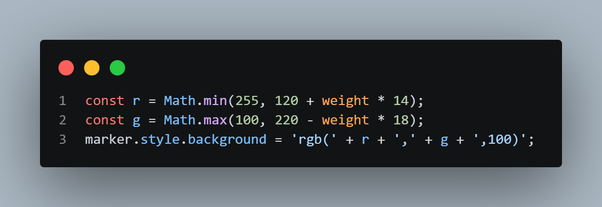

The seesaw tilts linearly based on the torque difference, capped at 30 degrees. So twice the torque difference means twice the tilt angle. The current state is saved in localStorage, which is why reloading the page doesn't wipe your setup.

## Sound effects

I added three sound effects to make it feel a bit more alive:

`click.wav` plays when you pause or resume
`creak.wav` plays while the seesaw is moving
`drop.wav` plays when you place a new weight

In the version I set up, these are all from Minecraft: the click is the UI click sound, the creak is the door creak, and the drop is the soil placement sound. You can grab the sample sounds I used here: [Google Drive folder](https://drive.google.com/drive/folders/1ckqD8UuzrznO0f7IHUhJ6BpufdH2OoLL?usp=drive_link).

---

## An alternative physics approach

Everything above describes how the project works by default. I also wanted to add something of my own on top of it, so I included an alternative approach as commented-out code.

In the default version, the seesaw tilts proportionally to the torque and stops at a fixed angle. That's not really how a seesaw behaves in real life though If you put even 1 kg more on one side, the heavier side should keep going down until it hits the ground, even if it moves slowly.

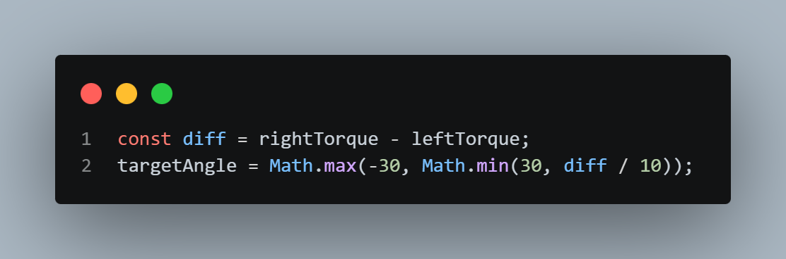
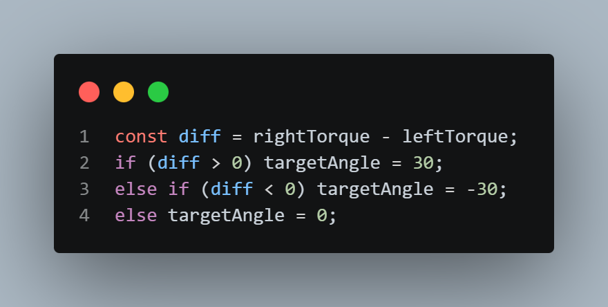

So in my alternative version, if one side is heavier, the seesaw keeps rotating until it touches the ground.

### Torque when the seesaw hits the ground

Now consider the moment the seesaw makes contact with the ground

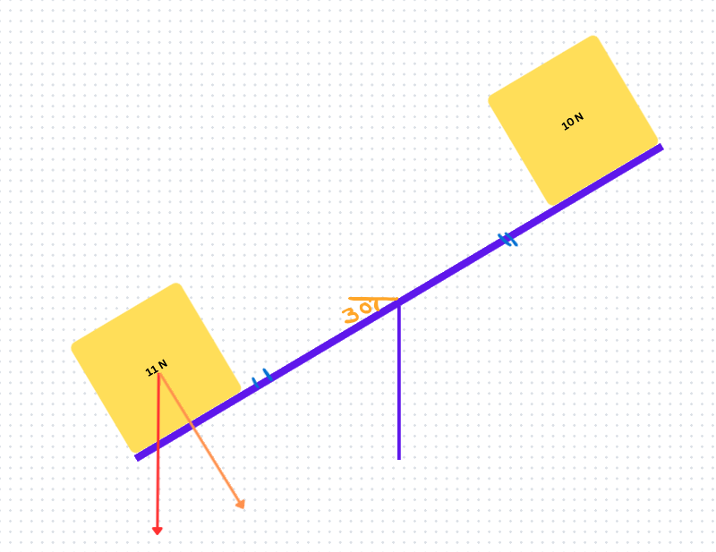

There's still torque acting on the seesaw, but it's no longer just `weight × arm_length` like in the simple version. We need the actual torque formula:

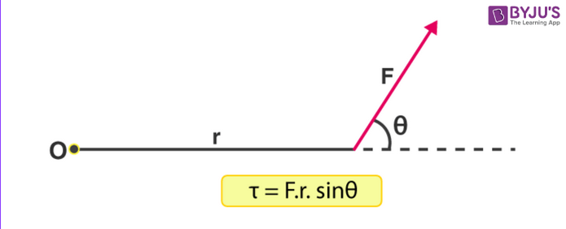

If we rearrange it, theta becomes `90 - currentAngle`. So instead of using `sin(90 - currentAngle)`…

…we can just use `cos(currentAngle)`, which gives the same result:
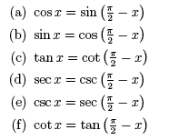

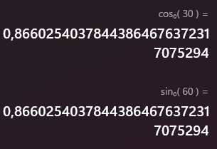

In code, the change looks like this:

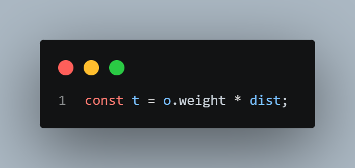
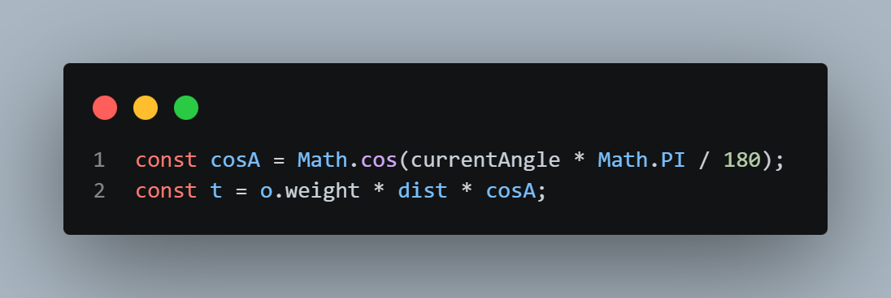

With this adjustment, the simulation behaves a lot more like real physics. As the seesaw rotates closer to horizontal, the effective torque increases, and as it tilts further away, the torque decreases.

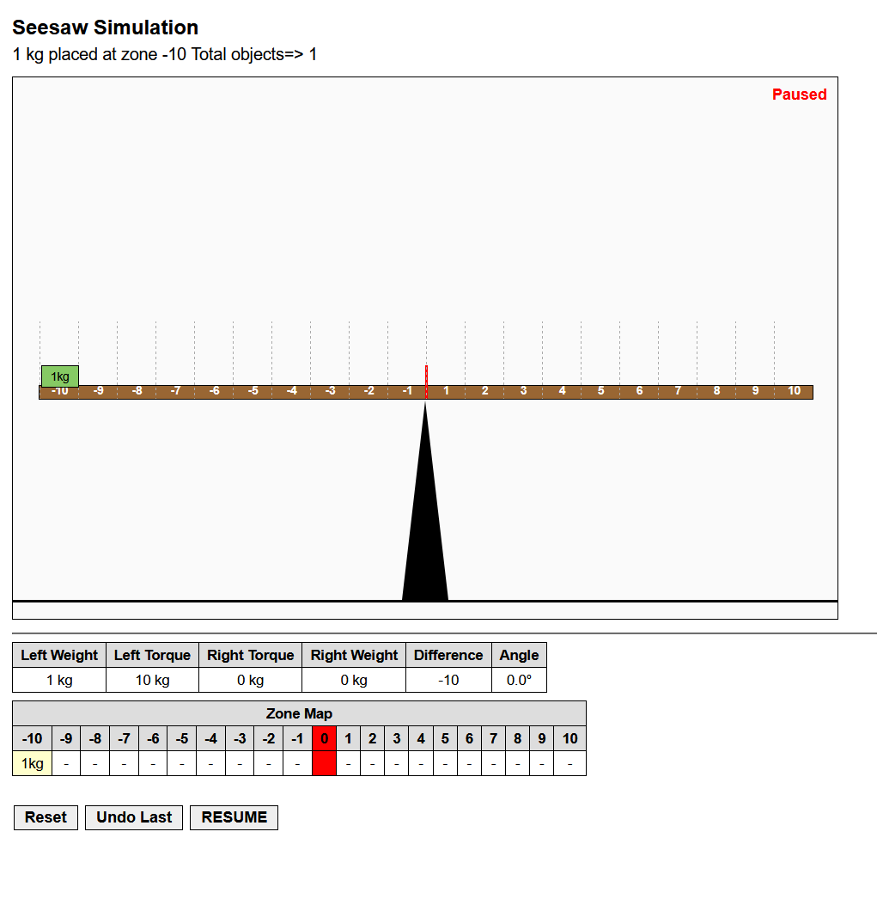
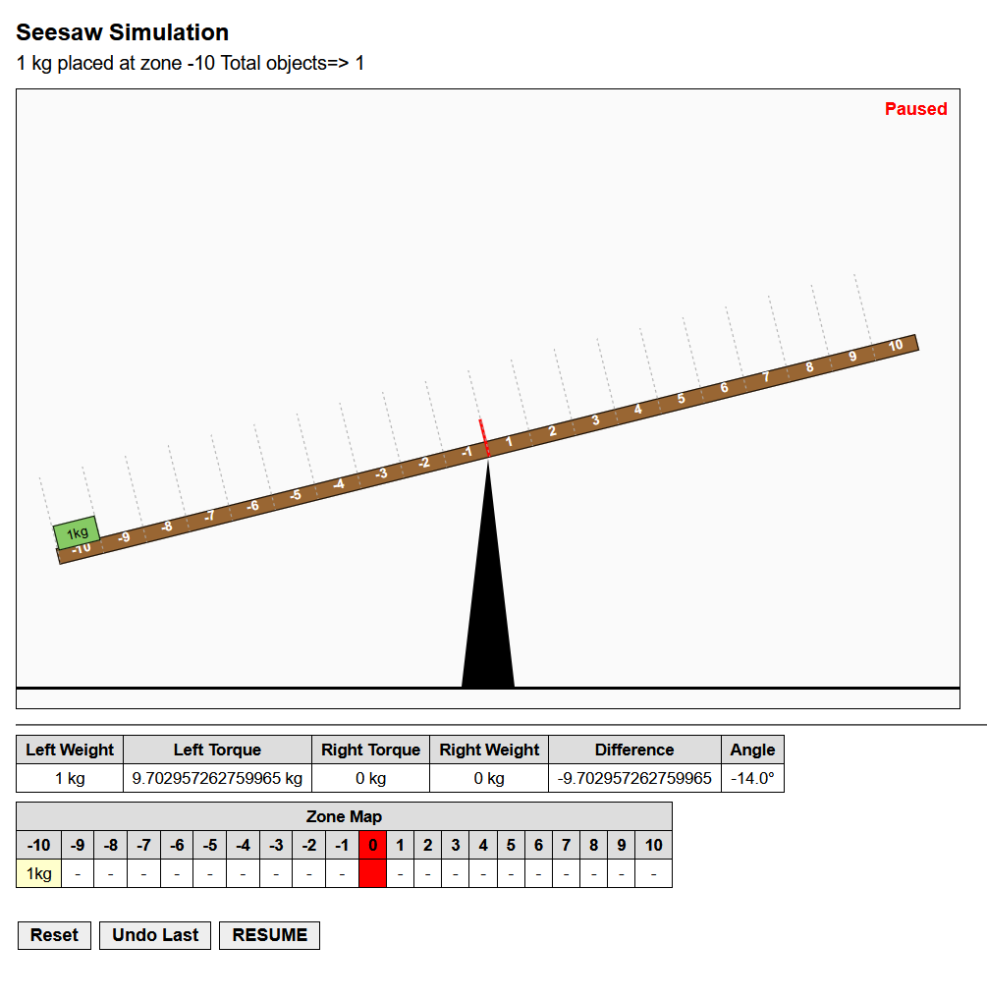
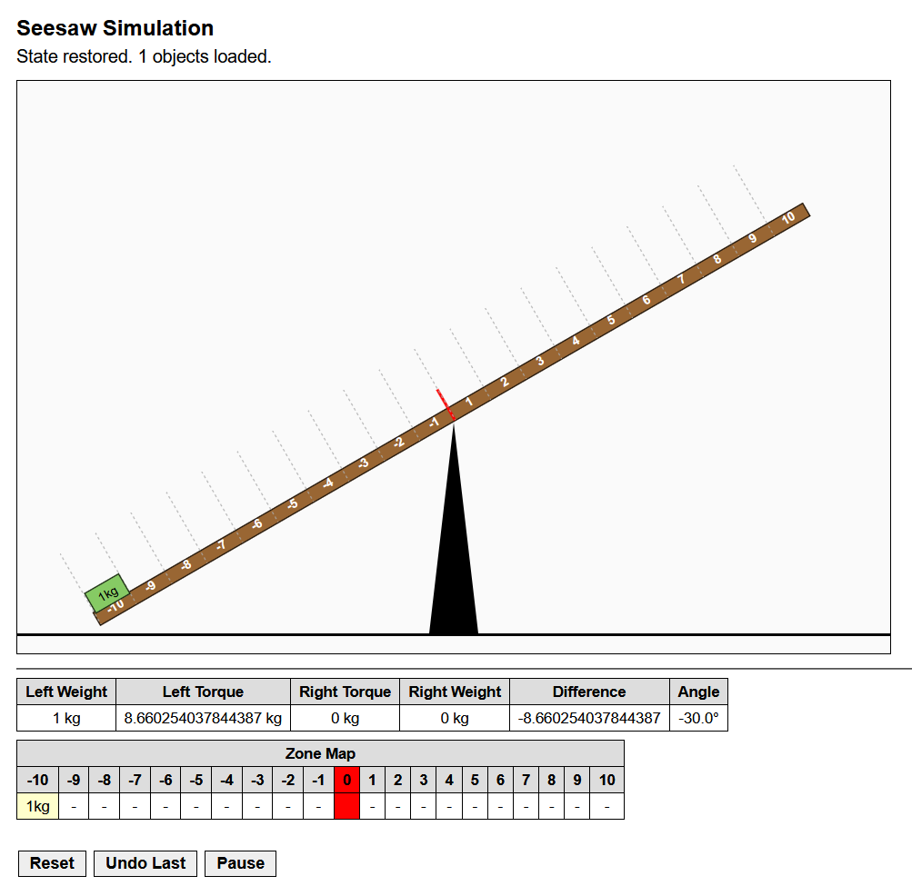

And if you place an equally heavy weight on the opposite side, the torques cancel out and the seesaw returns to its neutral position. Because there's no rotational force left on it.

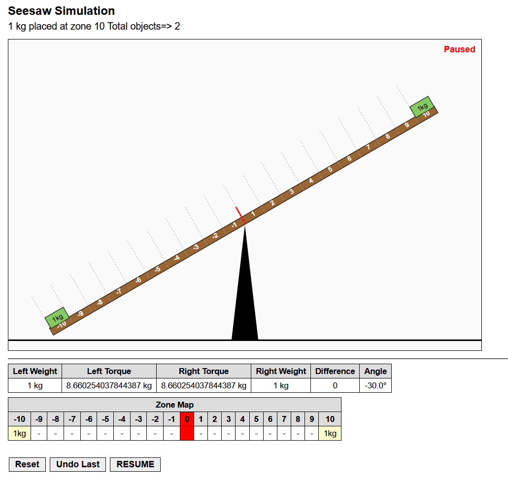
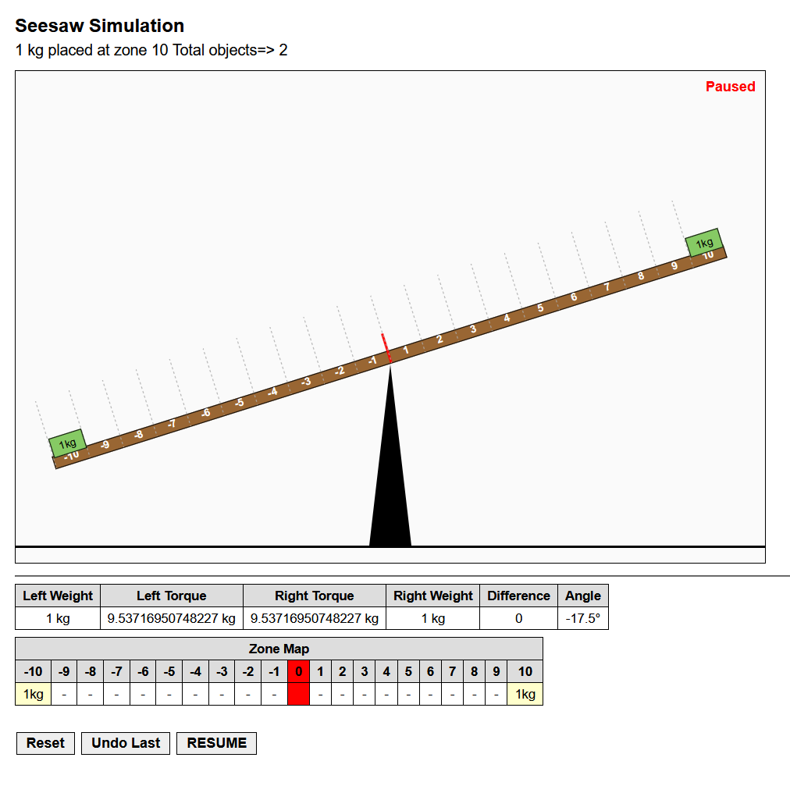
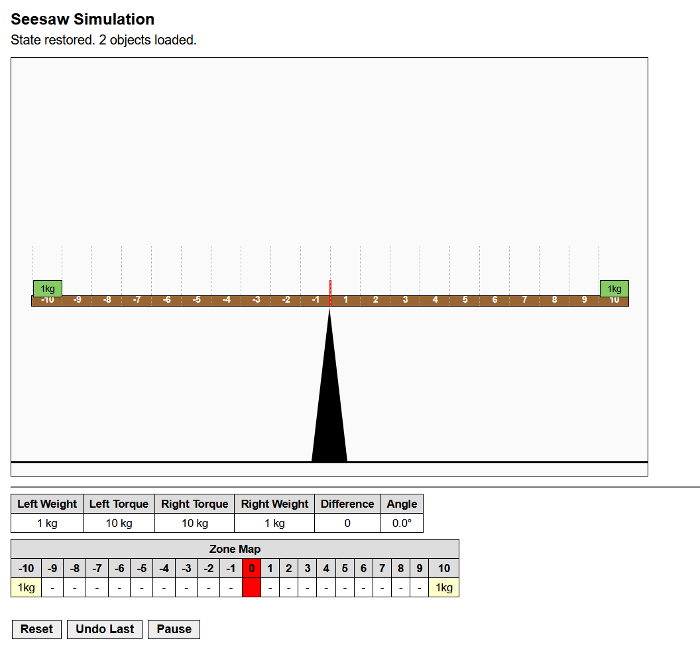

The alternative code is already in the JS file as comments. If you want to try it, just swap the "original code" blocks for the "alternative code" ones.

---

Thanks for taking the time to look through this. Feel free to reach out if you have any questions.

Hope to see you soon,
**Serhat Kemal**
